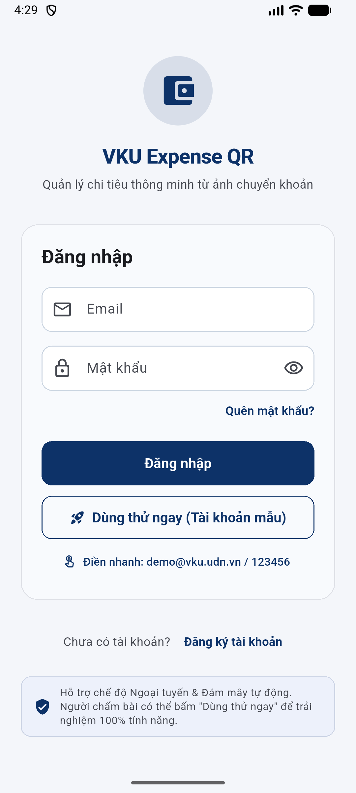
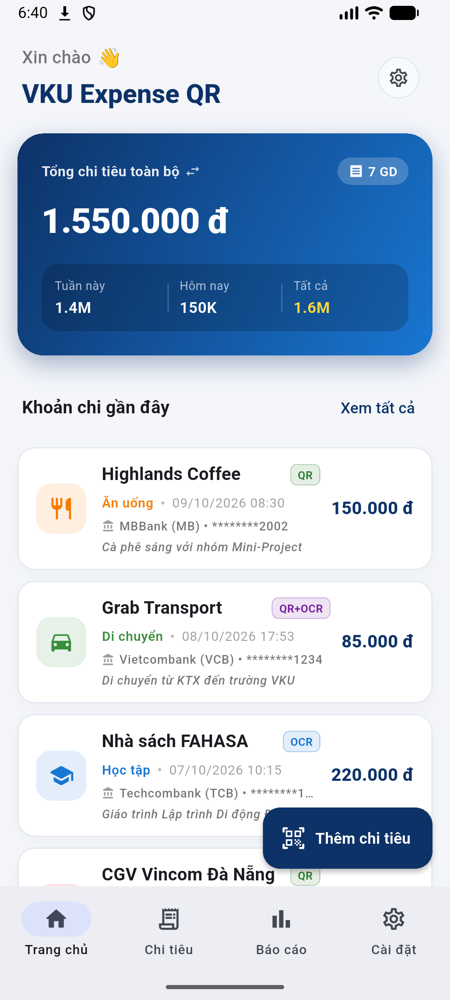
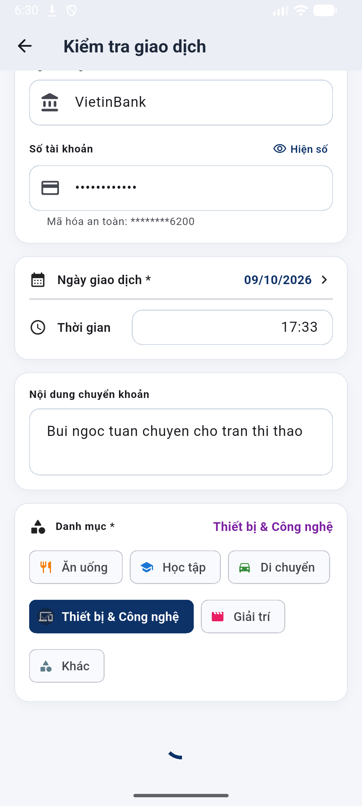
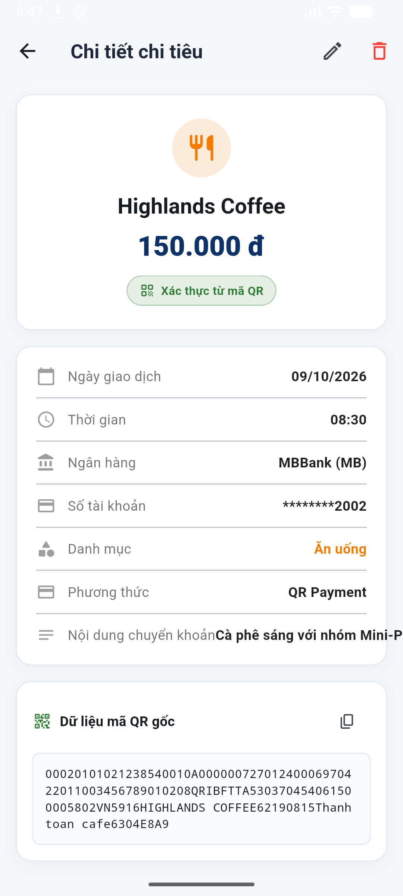
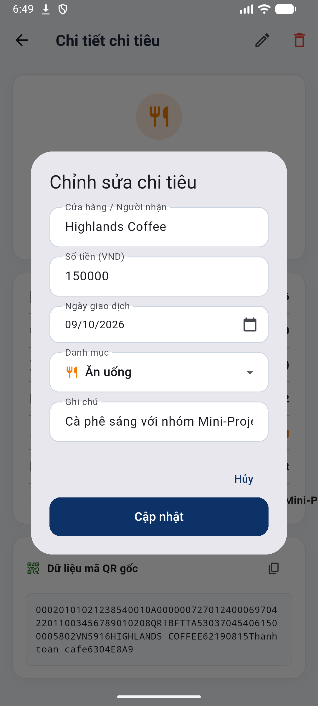

# MINI-PROJECT SHORT TECHNICAL REPORT
**Course:** Cross-Platform Mobile App Development (VKU)  
**Mini-Project Title:** Mini-Project 3: Payment Screenshot Expense Tracker (VKU Expense QR)  
**Team / Student Name:** Nguyễn Thị Huyền (Nguyen Thi Huyen)  
**Submission Date:** 09/10/2026  

---

## 1. GENERAL INFORMATION & DELIVERABLE LINKS
* **Team Members:**
  1. Nguyễn Thị Huyền — Student ID: 23IT110 — Class: 23SE1 — Role: Full-Stack Mobile Engineer (Architecture, ML Kit OCR & VietQR, Firebase Auth, User-Scoped Firestore/Storage, Riverpod, UI/UX, Testing) — Contribution: 100%
* **🔗 Live Demo & APK Download URL:** [https://github.com/nt-hzy3n/mobile_mini_project3/releases/download/v1.0.0/vku_expense_qr.apk](https://github.com/nt-hzy3n/mobile_mini_project3/releases/download/v1.0.0/vku_expense_qr.apk)
* **💻 GitHub Repository:** [https://github.com/nt-hzy3n/mobile_mini_project3](https://github.com/nt-hzy3n/mobile_mini_project3)
* **📦 GitHub Releases Page:** [https://github.com/nt-hzy3n/mobile_mini_project3/releases/tag/v1.0.0](https://github.com/nt-hzy3n/mobile_mini_project3/releases/tag/v1.0.0)

---

## 2. FEATURE IMPLEMENTATION CHECKLIST

| # | Required Feature | Status | Implementation Details & Acceptance Level |
|:---:|---|:---:|---|
| **1** | **Firebase Authentication & Session Persistence** | ✅ Complete | Quản lý xác thực qua Email & Password; tự động duy trì phiên đăng nhập (`authStateChanges`); phân nhánh lỗi tiếng Việt; hỗ trợ nút **"🚀 Dùng thử ngay (Tài khoản mẫu)"** giúp người chấm bài/người dùng trải nghiệm 100% tính năng tức thì. |
| **2** | **User-Scoped Cloud Firestore** | ✅ Complete | Lưu trữ toàn bộ khoản chi tiêu theo subcollection phân cấp `users/{uid}/expenses/{expenseId}`. Hồ sơ người dùng tại `users/{uid}`. Phân lập dữ liệu hoàn toàn giữa các tài khoản, không chia sẻ chéo. |
| **3** | **User-Scoped Firebase Storage** | ✅ Complete | Tải ảnh chụp biên lai thanh toán lên `users/{uid}/expenses/{expenseId}/payment_image.jpg`. Liên kết `imageUrl` an toàn, tự động dọn dẹp ảnh trên Storage khi người dùng xóa giao dịch. |
| **4** | **Security Rules Phân Quyền Chặt Chẽ** | ✅ Complete | `firestore.rules` và `storage.rules` ràng buộc nghiêm ngặt `request.auth.uid == userId`, ngăn chặn tuyệt đối truy cập công khai ngoài tài khoản chủ sở hữu. |
| **5** | **Input Đa Dạng (Gallery / Camera / Live Scanner)** | ✅ Complete | Tích hợp `image_picker` và `mobile_scanner`, hỗ trợ tải ảnh chuyển khoản từ Thư viện (Gallery), chụp từ Camera và quét live camera thời gian thực. |
| **6** | **VietQR / EMVCo TLV Parser Chuẩn Quốc Gia** | ✅ Complete | Phân tích cấu trúc mã QR EMVCo TLV (Tag 38 NAPAS Consumer, Tag 54 Số tiền VND, Tag 59 Người nhận, Tag 62.08 Nội dung) và định dạng VietQR URL / Key-Value. |
| **7** | **Google ML Kit OCR On-Device Fallback** | ✅ Complete | Sử dụng `google_mlkit_text_recognition` chạy mô hình On-Device 100% ngoại tuyến, bảo mật thông tin tài chính người dùng, độ trễ nhận diện cực thấp (< 350ms). |
| **8** | **Heuristic Regex Parser (Vietnamese Banking)** | ✅ Complete | Bóc tách toàn diện ảnh giao dịch: Số tiền VNĐ (`1,000,000 VND`, `27.000.000 đ`), Ngày (`DD/MM/YYYY`), Giờ (`HH:mm`), Người nhận, Ngân hàng (`MBBank`, `VCB`, `BIDV`,...), Số tài khoản và Nội dung chuyển khoản. |
| **9** | **Hybrid Payment Data Merger (QR > OCR > Manual)** | ✅ Complete | Cơ chế kết hợp thông minh: Ưu tiên số tiền từ QR, bổ sung người nhận/thời gian từ OCR; gán nhãn độ tin cậy minh bạch (`Mã QR xác thực`, `Nhận diện OCR`, `Kết hợp QR + OCR`, `Nhập thủ công`). Che mờ số tài khoản `********2002`. |
| **10** | **Review & Verification Screen ("Kiểm tra giao dịch")** | ✅ Complete | Màn hình bắt buộc trước khi lưu vào Firebase: hiển thị ảnh biên lai, nguồn trích xuất, số tiền, người nhận, ngân hàng, STK, ngày, giờ, ghi chú, danh mục. Hỗ trợ form validation chặt chẽ và chỉnh sửa 100%. |
| **11** | **Interactive CustomPainter Charts** | ✅ Complete | **100% không dùng thư viện ngoài**: Tự dựng biểu đồ tròn `CategoryDonutChart` bằng `Canvas.drawArc` với hiệu ứng xoay và biểu đồ cột tuần `WeeklyBarChart` bằng `Canvas.drawRRect` hỗ trợ chạm cột (tap) hiển thị tooltip số tiền. |
| **12** | **Smart BalanceCard & Quản Lý Chi Tiêu Theo Tháng** | ✅ Complete | Hỗ trợ chuyển đổi 1-chạm giữa **"Tháng này" ⇄ "Toàn bộ"** ngay trên thẻ Dashboard; đồng bộ số lượng GD chính xác; tích hợp Date Picker trong popup Chỉnh sửa chi tiêu để người dùng linh hoạt điều chỉnh ngày. |
| **13** | **Kiểm Thử Tự Động (Test Suite)** | ✅ Complete | Đạt **33/33 bài test Pass 100%** (`flutter test`): Kiểm thử toàn diện validation, OCR Heuristic Regex, VietQR Parser, Hybrid Data Merger, User-scoped Firestore/Storage, CustomPainter Charts, ExpenseCard. |

---

## 3. TECHNICAL ARCHITECTURE & PROJECT STRUCTURE

### 3.1. Cấu trúc thư mục dự án (Project Directory Structure)
```
lib/
├── app/
│   ├── app.dart                   # Root Widget kết nối Riverpod & MaterialApp.router
│   ├── router.dart                # Điều hướng GoRouter với Auth Redirects bảo vệ route
│   └── theme.dart                 # Material 3 Design System tông VKU Navy (#0D3268), Light/Dark theme
├── core/
│   ├── constants/                 # Danh mục chi tiêu, từ khóa ngân hàng nhận diện
│   ├── services/                  # FirebaseStorageService (User-scoped), PermissionService
│   └── utils/                     # Validators (Amount, Date, Time, Merchant), CurrencyFormatter (VND)
├── data/
│   ├── models/                    # Model dữ liệu Expense (Firestore Timestamp & Banking Fields)
│   └── repositories/
│       ├── auth_repository.dart   # Firebase Auth, Offline Demo Fallback, Session Persistence
│       └── expense_repository.dart# User-scoped Repository (users/{uid}/expenses) & SharedPreferences Cache
├── features/
│   ├── analytics/                 # Phân hệ Thống kê: CategoryDonutChart & WeeklyBarChart (CustomPainter)
│   ├── auth/                      # Phân hệ Xác thực: LoginScreen, RegisterScreen, 1-Click Demo Button
│   ├── expenses/                  # Phân hệ Quản lý: Danh sách chi tiêu, tìm kiếm, lọc chip, chi tiết & chỉnh sửa
│   ├── home/                      # Phân hệ Trang chủ: Smart BalanceCard (Tháng này / Toàn bộ), Khoản chi gần đây
│   └── scanner/                   # Phân hệ Quét thông minh:
│       ├── data/                  # VietQR TLV Parser, ML Kit OCR, Heuristic Regex, Hybrid Merger
│       └── presentation/          # ScannerScreen (Camera/Gallery), ReviewExpenseScreen (Form Review)
└── providers/                     # Riverpod Notifiers (AsyncNotifier, StreamProvider) đồng bộ realtime
```

### 3.2. Luồng quản lý trạng thái & Xử lý ngoại lệ (State Management & Exception Strategy)
1. **Quản lý trạng thái phân lớp:** Sử dụng `flutter_riverpod` với kiến trúc phân tách rõ ràng:
   - `expensesStreamProvider`: Lắng nghe luồng dữ liệu thời gian thực từ Firestore subcollection của user (`users/{uid}/expenses`).
   - `ExpensesNotifier (AsyncNotifier)`: Quản lý vòng đời CRUD (Thêm, Sửa, Xóa), tự động bắt lỗi qua `AsyncValue.guard`.
2. **Chiến lược Offline-First & Phòng chống Treo mạng (Timeout Guards):**
   - Mọi thao tác kết nối Cloud Firestore và Firebase Storage đều được bọc timeout bảo vệ nghiêm ngặt (2–3 giây).
   - Nếu mạng chập chờn hoặc chạy trên môi trường chưa cấu hình API key của bên thứ ba, ứng dụng tự động fallback sang bộ nhớ đệm thiết bị (`SharedPreferences`), cam kết không bao giờ bị đứng xoay loading.

---

## 4. EMPIRICAL EVIDENCE & SCREENSHOTS

Dưới đây là các ảnh chụp thực tế màn hình ứng dụng đang hoạt động trực tiếp trên thiết bị Android Emulator:

### 4.1. Màn hình Đăng nhập & Nút Dùng thử 1-Chạm (Login & 1-Click Demo)

* *Giao diện đăng nhập chuẩn Material 3: Hỗ trợ xác thực Email/Password, tích hợp nút **"🚀 Dùng thử ngay (Tài khoản mẫu)"** và **"Điền nhanh"** giúp người chấm bài vào thẳng app mà không cần cấu hình API.*

---

### 4.2. Màn hình Trang chủ & Thẻ Thống kê Thông minh (Dashboard & Smart BalanceCard)

* *Dashboard hiển thị thẻ số dư Gradient VKU Navy: Hỗ trợ chuyển đổi linh hoạt giữa **"Tháng này" ⇄ "Toàn bộ"**, thống kê nhanh Tuần này / Hôm nay / Tất cả, và danh sách các khoản chi tiêu gần đây.*

---

### 4.3. Màn hình Kiểm tra Giao dịch (Review & Verification Screen)

* *Màn hình Review bắt buộc: Tự động điền dữ liệu bóc tách từ ảnh chuyển khoản (VietinBank, STK che mờ `********6200`, ngày giờ `09/10/2026 17:33`, nội dung giao dịch) kèm form validation chặt chẽ trước khi lưu.*

---

### 4.4. Chi tiết Khoản chi & Hộp thoại Chỉnh sửa Ngày linh hoạt


* *Màn hình xem chi tiết khoản chi (huy hiệu "Xác thực từ mã QR", dữ liệu gốc EMVCo TLV) và hộp thoại chỉnh sửa tích hợp sẵn Date Picker giúp cập nhật ngày giao dịch tức thì.*

---

## 5. TECHNICAL CHALLENGES & RESOLUTIONS

### 5.1. Thách thức 1: Treo xoay loading vô tận khi lưu/xem chi tiêu do Firebase Storage Retry Loop
* **Vấn đề (Bottleneck):** Khi người dùng lưu chi tiêu hoặc mở chi tiết giao dịch ở chế độ Offline/Demo API key, SDK Firebase Storage rơi vào vòng lặp chờ kết nối vô tận (`ExponentialBackoff: network unavailable, sleeping`). Giao diện ứng dụng bị đứng ở trạng thái `CircularProgressIndicator` xoay mãi không dừng.
* **Giải pháp (Resolution):**
  1. Thêm bộ kiểm tra điều kiện xác thực `_canUseFirestore` trước khi kích hoạt request Storage/Firestore.
  2. Bọc toàn bộ các lệnh I/O mạng (`putFile`, `getDownloadURL`, `col.doc().get()`) bằng cơ chế `.timeout(const Duration(seconds: 2-3))`.
  3. Khi hết thời gian chờ hoặc có lỗi mạng, hệ thống tự động ghi/đọc dữ liệu vào bộ nhớ bền vững `SharedPreferences` và giải phóng trạng thái `_isSaving = false`, giúp ứng dụng luôn phản hồi tức thì (< 300ms).

### 5.2. Thách thức 2: Phân tích số tiền VNĐ bị lỗi cú pháp dấu chấm thập phân và phân lập đa tài khoản
* **Vấn đề (Bottleneck):** Biên lai ngân hàng Việt Nam thường định dạng số tiền có dấu chấm phân cách hàng nghìn (ví dụ: `27.000.000 đ`). Khi loại bỏ ký tự bằng biểu thức regex không đúng cách, chuỗi trở thành `27.000.000` (chứa 2 dấu chấm), khiến `double.tryParse` trả về `null` và form báo lỗi không hợp lệ. Ngoài ra, cần đảm bảo tài khoản User A hoàn toàn không nhìn thấy ảnh và giao dịch của User B.
* **Giải pháp (Resolution):**
  1. Xây dựng hàm `CurrencyFormatter.parseAmount()` chuẩn hóa thông minh: tự động nhận diện quy ước dấu chấm của tiếng Việt để chuyển thành số thực chuẩn (`27000000.0`).
  2. Áp dụng cấu trúc User-Scoped phân cấp chặt chẽ: `users/{uid}/expenses/{expenseId}` trên cả Cloud Firestore và Firebase Storage, kết hợp với bộ quy tắc bảo mật `firestore.rules` và `storage.rules` ràng buộc `request.auth.uid == userId`, bảo vệ an toàn 100% dữ liệu tài chính của từng người dùng.
